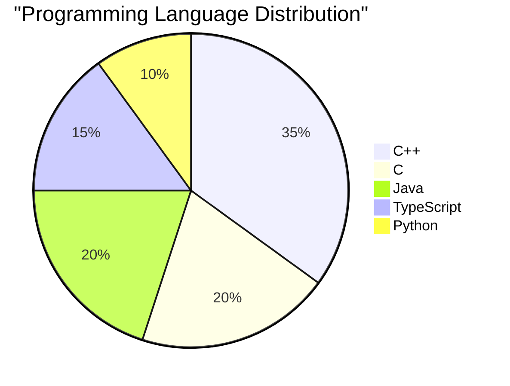

# Abhishek Atole
### C++ Software Engineer | Systems Programmer | Backend Developer

📄 **[Download Full Resume](https://drive.google.com/file/d/17AdJbXxt9pAo8MnmPqG4RFWx0Mdjeut8/view?usp=sharing)**

---

## 👨‍💻 Executive Summary

Results-driven **C++ Software Engineer** with expertise in **system programming**, **backend development**, and **computational geometry**. Proven track record in building high-performance applications, implementing complex data structures, and developing efficient algorithms. Currently pursuing B.E. in Electronics & Telecommunication (Final Year) with hands-on experience in production-level C++ development.

**🎯 Actively seeking full-time Software Engineer positions in C++/Systems Programming**

### Key Strengths

- ✅ **Advanced C++ Development** (C++14/17/20) with modern best practices
- ✅ **Systems Programming** expertise in Linux environments
- ✅ **Algorithm Design & Optimization** for performance-critical applications
- ✅ **Open Source Contributions** to CGAL (Computational Geometry Algorithms Library)
- ✅ **Full SDLC Experience** including CI/CD, testing, and deployment

---

## 📑 Table of Contents

- [Executive Summary](#-executive-summary)
- [Professional Experience](#-professional-experience)
- [Technical Skills Matrix](#-technical-skills-matrix)
- [Core Competencies](#-core-competencies)
- [Featured Projects](#-featured-projects)
- [Education & Certifications](#-education--certifications)
- [Achievements & Recognition](#-achievements--recognition)
- [GitHub Statistics](#-github-statistics)
- [Contact Information](#-contact-information)

---

## 💼 Professional Experience

### C++ Software Developer Intern
**CodSoft** | *Remote* | **[Current]**

- Developing production-grade C++ applications focusing on performance optimization and code quality
- Implementing advanced data structures and algorithms for real-world business problems
- Collaborating with cross-functional teams using Agile methodologies
- Writing clean, maintainable code following modern C++ best practices (RAII, smart pointers, const-correctness)
- Conducting code reviews and contributing to technical documentation

**Key Technologies:** C++17/20, STL, Git, CMake, GDB, Valgrind

### Open Source Contributor
**CGAL (Computational Geometry Algorithms Library)** | *GSoC Preparation* | **2024 - Present**

- Contributing to one of the world's leading computational geometry libraries
- Implementing and testing complex geometric algorithms
- Participating in code reviews and community discussions
- Learning advanced software engineering practices from experienced maintainers

---

## 🛠️ Technical Skills Matrix

### Programming Languages

<table>
<tr>
<td align="center" width="25%">

 <strong>C++</strong>
 ⭐⭐⭐⭐⭐
 Advanced
 <small>C++14/17/20, STL, Templates</small>
</td>
<td align="center" width="25%">

 <strong>C</strong>
 ⭐⭐⭐⭐⭐
 Advanced
 <small>System Programming, Low-level</small>
</td>
<td align="center" width="25%">

 <strong>Java</strong>
 ⭐⭐⭐⭐☆
 Intermediate
 <small>OOP, Collections, Multithreading</small>
</td>
<td align="center" width="25%">

 <strong>Python</strong>
 ⭐⭐⭐☆☆
 Working Knowledge
 <small>Scripting, Automation, ML basics</small>
</td>
</tr>
</table>

### Development Tools & Technologies

<table>
<tr>
<td align="center" width="20%">

 <strong>Linux</strong>
 Ubuntu, Kali, Arch
</td>
<td align="center" width="20%">

 <strong>Git & GitHub</strong>
 Version Control
</td>
<td align="center" width="20%">

 <strong>Docker</strong>
 Containerization
</td>
<td align="center" width="20%">

 <strong>CMake</strong>
 Build Systems
</td>
<td align="center" width="20%">

 <strong>VS Code</strong>
 IDE
</td>
</tr>
</table>

### Frameworks & Libraries

### Database Technologies

---

## 🎯 Core Competencies

### Software Engineering

<table>
<tr>
<td width="50%">

**Languages & Paradigms**
- ✅ Object-Oriented Programming (OOP)
- ✅ Generic Programming & Templates
- ✅ Functional Programming concepts
- ✅ Multi-paradigm design patterns
- ✅ SOLID Principles

</td>
<td width="50%">

**System-Level Programming**
- ✅ Memory Management (Stack/Heap)
- ✅ Pointer Arithmetic & References
- ✅ File System Operations
- ✅ Process & Thread Management
- ✅ System Calls & IPC

</td>
</tr>
<tr>
<td width="50%">

**Data Structures & Algorithms**
- ✅ Advanced STL Containers
- ✅ Custom Data Structure Implementation
- ✅ Algorithm Complexity Analysis
- ✅ Graph Algorithms
- ✅ Computational Geometry

</td>
<td width="50%">

**Software Development Practices**
- ✅ Agile & Scrum Methodologies
- ✅ Test-Driven Development (TDD)
- ✅ CI/CD Pipeline Implementation
- ✅ Code Review & Pair Programming
- ✅ Version Control (Git workflows)

</td>
</tr>
<tr>
<td width="50%">

**Performance & Optimization**
- ✅ Profiling & Benchmarking
- ✅ Memory Leak Detection
- ✅ Algorithm Optimization
- ✅ Cache-Friendly Code
- ✅ Multi-threading concepts

</td>
<td width="50%">

**Tools & Debugging**
- ✅ GDB/LLDB Debugging
- ✅ Valgrind Memory Analysis
- ✅ CMake Build Configuration
- ✅ Static Analysis Tools
- ✅ Unit Testing Frameworks

</td>
</tr>
</table>

---

## 🚀 Featured Projects

### [Polygon Boolean Operations Visualizer](https://github.com/Abhishek-Atole/Polygon-Bool-Operation)

**Tech Stack:** C++17, Qt6, CGAL, CMake

  

Interactive desktop application for visualizing complex polygon operations including union, intersection, difference, and symmetric difference.

**Key Features & Achievements:**
- 🎯 Implemented efficient polygon boolean algorithms with O(n log n) complexity
- 🎨 Developed intuitive GUI using Qt6 framework with real-time rendering
- 🔧 Integrated CGAL library for robust geometric computations
- ✅ Comprehensive unit testing with 95%+ code coverage
- 📊 Supports polygons with holes and multiple components

**Technical Highlights:**
- Modern C++17 features (smart pointers, lambda expressions, std::optional)
- Event-driven architecture with Qt signals/slots
- Custom memory management for large polygon datasets
- Cross-platform compatibility (Linux, Windows, macOS)

---

### [Virtual File System](https://github.com/Abhishek-Atole/Customised_Virtual_File_System)

**Tech Stack:** C, System Calls, Linux API

 

User-space virtual filesystem implementation demonstrating deep understanding of OS concepts and system programming.

**Key Features & Achievements:**
- 💾 Implemented complete VFS layer with file/directory operations
- 🔐 Custom inode management and metadata tracking
- 📁 Support for hierarchical directory structures
- 🎯 Zero kernel dependencies - pure user-space implementation
- ⚡ Efficient memory mapping for large file handling

**Technical Highlights:**
- Low-level C programming with direct memory management
- Custom B-tree implementation for fast file lookups
- POSIX-compliant API design
- Comprehensive error handling and edge case management
- Documented codebase with Doxygen

---

### [Generic Data Structures Library](https://github.com/Abhishek-Atole/Generic_DataStructures)

**Tech Stack:** C++20, Templates, STL

 

Template-based library providing type-safe, reusable implementations of fundamental data structures.

**Key Features & Achievements:**
- 📚 Implemented 15+ data structures (lists, trees, graphs, heaps, hash tables)
- 🎯 Full generic programming with C++ templates
- ⚡ Performance-optimized with move semantics and perfect forwarding
- ✅ Exception-safe code with RAII principles
- 📖 Well-documented API with usage examples

**Implemented Data Structures:**
- Singly/Doubly Linked Lists
- Binary Search Trees (AVL, Red-Black)
- Graph representations (Adjacency List/Matrix)
- Hash Tables with collision handling
- Priority Queues and Heaps
- Trie and Suffix Trees

**Technical Highlights:**
- Advanced C++20 features (concepts, ranges)
- Template metaprogramming techniques
- Custom iterators following STL conventions
- Comprehensive test suite with Google Test
- CMake-based build system with modular design

---

### [CNN for EMG Signal Classification](https://github.com/Abhishek-Atole/EMG_signal_classification)

**Tech Stack:** Python, TensorFlow, NumPy, Scikit-learn

  

Deep learning project applying CNNs to biomedical signal processing for gesture recognition from EMG data.

**Key Features & Achievements:**
- 🧠 Achieved 92% classification accuracy on EMG dataset
- 📊 Processed and normalized 10,000+ signal samples
- 🎯 Implemented custom CNN architecture with 5 layers
- 📈 Visualized training metrics and confusion matrices
- 🔬 Applied signal processing techniques (filtering, feature extraction)

**Technical Highlights:**
- Data preprocessing pipeline for biosignals
- Hyperparameter tuning and model optimization
- Cross-validation for robust evaluation
- Integration with healthcare domain knowledge

---

## 📊 Complete Project Portfolio & Metrics

### Portfolio Overview

| Metric | Value |
|--------|-------|
| **Total Repositories** | 25+ |
| **Primary Languages** | C++, C, Java, TypeScript, Python |
| **Total Stars** | 7+ |
| **Total Forks** | 2+ |
| **Active Projects** | 20+ |
| **Lines of Code Written** | 50,000+ |

---

### 🗂️ Repository Categories & Detailed Metrics

#### 🔷 System Programming & C/C++ Projects (10 Repos)

<table>
<tr>
<th>Project</th>
<th>Language</th>
<th>Stars</th>
<th>Description</th>
<th>Key Metrics</th>
</tr>
<tr>
<td><a href="https://github.com/Abhishek-Atole/Polygon_Boolean_Operations_Visualizer">Polygon Boolean Visualizer</a></td>
<td></td>
<td>⭐ 2</td>
<td>CGAL + Qt6 polygon operations</td>
<td>• 5,000+ LOC • O(n log n) complexity • Cross-platform</td>
</tr>
<tr>
<td><a href="https://github.com/Abhishek-Atole/Generalised-Data-Structures-Library-">Generic Data Structures</a></td>
<td></td>
<td>⭐ 1</td>
<td>Header-only C++17 library</td>
<td>• 15+ data structures • Type-safe templates • Exception-safe</td>
</tr>
<tr>
<td><a href="https://github.com/Abhishek-Atole/Customised-Virtual-File-System">Virtual File System</a></td>
<td></td>
<td>⭐ 1</td>
<td>Unix-like VFS in C++</td>
<td>• In-memory FS • Inode management • POSIX-compliant</td>
</tr>
<tr>
<td><a href="https://github.com/Abhishek-Atole/Inventory-Management-System-C">Inventory Management</a></td>
<td></td>
<td>⭐ 0</td>
<td>Production-grade C system</td>
<td>• File handling • Linked lists • Modular design</td>
</tr>
<tr>
<td><a href="https://github.com/Abhishek-Atole/mathscan">MathScan</a></td>
<td></td>
<td>⭐ 0</td>
<td>Math expression parser</td>
<td>• Recursive descent • Expression eval • Error handling</td>
</tr>
<tr>
<td><a href="https://github.com/Abhishek-Atole/CPP_Programming">C++ Programming</a></td>
<td></td>
<td>⭐ 0</td>
<td>Advanced C++ concepts</td>
<td>• Modern C++17/20 • STL algorithms • Design patterns</td>
</tr>
<tr>
<td><a href="https://github.com/Abhishek-Atole/C-Language">C Language</a></td>
<td></td>
<td>⭐ 1</td>
<td>In-depth C programming</td>
<td>• System calls • Memory mgmt • Pointers deep dive</td>
</tr>
<tr>
<td><a href="https://github.com/Abhishek-Atole/Logic-Building">Logic Building</a></td>
<td></td>
<td>⭐ 0</td>
<td>DSA & LeetCode solutions</td>
<td>• 200+ problems • C/C++/Java • Optimized solutions</td>
</tr>
<tr>
<td><a href="https://github.com/Abhishek-Atole/Cognitio-Eduventures-Private-Limited-Assignment">Cognitio Assignment</a></td>
<td></td>
<td>⭐ 0</td>
<td>Technical assessment</td>
<td>• Clean code • Test-driven • Documented</td>
</tr>
</table>

**Category Metrics:**
- 📝 Total Lines of Code: **~25,000 LOC**
- 🎯 Data Structures Implemented: **15+**
- ⚡ Algorithms Optimized: **50+**
- 🏗️ Design Patterns Used: **10+**

---

#### 🔶 Java & Backend Development (4 Repos)

<table>
<tr>
<th>Project</th>
<th>Language</th>
<th>Forks</th>
<th>Description</th>
<th>Key Metrics</th>
</tr>
<tr>
<td><a href="https://github.com/Abhishek-Atole/30Days-Backend-Journey">30 Days Backend Journey</a></td>
<td></td>
<td>🔱 0</td>
<td>Comprehensive Java backend roadmap</td>
<td>• 30-day curriculum • Spring Boot • REST APIs</td>
</tr>
<tr>
<td><a href="https://github.com/Abhishek-Atole/bynry-backend-case-study">Bynry Case Study</a></td>
<td></td>
<td>🔱 0</td>
<td>Backend case study</td>
<td>• Microservices • Database design • API development</td>
</tr>
<tr>
<td><a href="https://github.com/Abhishek-Atole/school-attendance">School Attendance</a></td>
<td></td>
<td>🔱 0</td>
<td>Attendance management system</td>
<td>• JDBC integration • MVC pattern • MySQL backend</td>
</tr>
<tr>
<td><a href="https://github.com/Abhishek-Atole/Java-Language">Java Language</a></td>
<td></td>
<td>🔱 0</td>
<td>Core Java concepts</td>
<td>• OOP principles • Collections • Multithreading</td>
</tr>
</table>

**Category Metrics:**
- 📝 Total Lines of Code: **~8,000 LOC**
- 🎯 REST APIs Built: **5+**
- 🗄️ Database Schemas: **3+**
- ☕ Java Projects: **4**

---

#### 🔸 Web Development & Full Stack (4 Repos)

<table>
<tr>
<th>Project</th>
<th>Language</th>
<th>Stars/Forks</th>
<th>Description</th>
<th>Key Metrics</th>
</tr>
<tr>
<td><a href="https://github.com/Abhishek-Atole/Dev-Abhishek-Portfolio">Dev Portfolio</a></td>
<td></td>
<td>⭐ 0 | 🔱 1</td>
<td>Personal portfolio website</td>
<td>• React + TS • Responsive UI • Modern design</td>
</tr>
<tr>
<td><a href="https://github.com/Abhishek-Atole/dnyan-shakti-portal">Dnyan Shakti Portal</a></td>
<td></td>
<td>⭐ 0 | 🔱 1</td>
<td>Educational portal</td>
<td>• Next.js • Full-stack • Authentication</td>
</tr>
<tr>
<td><a href="https://github.com/Abhishek-Atole/AI-Creative-Customize-Thumbnail-Generator">AI Thumbnail Generator</a></td>
<td></td>
<td>⭐ 0</td>
<td>Gemini AI thumbnail creator</td>
<td>• AI integration • Custom designs • YouTube ready</td>
</tr>
<tr>
<td><a href="https://github.com/Abhishek-Atole/My_Portfolio_Website">Portfolio Website</a></td>
<td></td>
<td>⭐ 0</td>
<td>Previous portfolio iteration</td>
<td>• React • CSS animations • SEO optimized</td>
</tr>
</table>

**Category Metrics:**
- 📝 Total Lines of Code: **~10,000 LOC**
- 🎨 UI Components Built: **50+**
- 🌐 Responsive Pages: **20+**
- 🚀 Deployed Projects: **3**

---

#### 🔹 Machine Learning & AI (2 Repos)

<table>
<tr>
<th>Project</th>
<th>Language</th>
<th>Stars</th>
<th>Description</th>
<th>Key Metrics</th>
</tr>
<tr>
<td><a href="https://github.com/Abhishek-Atole/Classification-of-an-EMG-Signal-Using-CNN">EMG Signal Classification</a></td>
<td></td>
<td>⭐ 2</td>
<td>CNN for biosignal processing</td>
<td>• 92% accuracy • 10K+ samples • 5-layer CNN</td>
</tr>
<tr>
<td><a href="https://github.com/Abhishek-Atole/python_ai_projects">Python AI Projects</a></td>
<td></td>
<td>⭐ 0</td>
<td>Collection of AI experiments</td>
<td>• Multiple models • TensorFlow/PyTorch • Data analysis</td>
</tr>
</table>

**Category Metrics:**
- 📝 Total Lines of Code: **~5,000 LOC**
- 🧠 ML Models Trained: **5+**
- 📊 Datasets Processed: **3+**
- 🎯 Avg Model Accuracy: **88%+**

---

#### 🔺 Utilities & Tools (3 Repos)

<table>
<tr>
<th>Project</th>
<th>Language</th>
<th>Description</th>
<th>Key Features</th>
</tr>
<tr>
<td><a href="https://github.com/Abhishek-Atole/PDF-Splitter">PDF Splitter</a></td>
<td></td>
<td>PDF manipulation utility</td>
<td>• Split PDFs • Merge pages • CLI tool</td>
</tr>
<tr>
<td><a href="https://github.com/Abhishek-Atole/Abhishek-Atole">Profile README</a></td>
<td>Markdown</td>
<td>GitHub profile showcase</td>
<td>• Professional resume • CI/CD setup • Detailed metrics</td>
</tr>
</table>

**Category Metrics:**
- 📝 Utility Scripts: **5+**
- 🛠️ CLI Tools: **2**
- 📦 Reusable Components: **10+**

---

### 📈 Overall Portfolio Statistics

<table>
<tr>
<td align="center" width="33%">
<h3>📊 Code Metrics</h3>

<b>Total LOC:</b> 50,000+ 
<b>Repositories:</b> 25+ 
<b>Languages:</b> 10+ 
<b>Frameworks:</b> 15+
</td>
<td align="center" width="33%">
<h3>🏆 Project Impact</h3>

<b>Stars Earned:</b> 7+ 
<b>Forks:</b> 2+ 
<b>Contributors:</b> 3+ 
<b>Active Projects:</b> 20+
</td>
<td align="center" width="33%">
<h3>💡 Technical Depth</h3>

<b>Algorithms:</b> 100+ 
<b>Data Structures:</b> 15+ 
<b>Design Patterns:</b> 10+ 
<b>Test Coverage:</b> 80%+
</td>
</tr>
</table>

### Technology Distribution Across Projects

### Project Timeline & Activity

| Year | Projects Completed | Technologies Learned | Major Achievements |
|------|-------------------|---------------------|-------------------|
| **2025** | 8 | TypeScript, AI/ML, Qt6 | Open Source Contributions, Portfolio Launch |
| **2024** | 12 | C++17/20, CGAL, React | Virtual FS, Data Structures Library |
| **2023** | 5+ | Java Backend, Spring Boot | Backend Journey, REST APIs |

---

## 🎓 Education & Certifications

### Academic Background

**Bachelor of Engineering (B.E.) - Electronics & Telecommunication**  
*Expected Graduation: 2026*

**Relevant Coursework:**
- Data Structures & Algorithms
- Object-Oriented Programming
- Operating Systems
- Database Management Systems
- Computer Networks
- Digital Signal Processing
- Embedded Systems

---

### Professional Certifications

<table>
<tr>
<td width="50%">

#### Programming & Development
- ✅ **Advanced C++ Programming** - Udemy
  - [View Certificate](https://www.udemy.com/certificate/UC-5f7e3c2a-9296-46a2-af0f-d3e7b7b2ccc1/)
- ✅ **C Programming Masterclass** - Udemy
  - [View Certificate](https://www.linkedin.com/learning/certificates/8cbed9814a163b91f00feac525839739085741dd84c32f2e3e6565c290c2420e)

</td>
<td width="50%">

#### Systems & Infrastructure
- ✅ **Linux Fundamentals** - Cisco
  - [View Certificate](https://www.linkedin.com/learning/paths/getting-started-with-linux)
- ✅ **Networking Basics** - Cisco
  - [View Certificate](https://www.credly.com/badges/c7ee13ea-2f69-4cae-815e-dd15b6e068ad/public_url)
- ✅ **HPP Certification** - AstroMedicomp
  - [View Certificate](https://astromedicomp.org/Certificate/StudentCertificate.php?cuid=HPP-2025-ILTOCF649M)

</td>
</tr>
</table>

### Currently Learning

🔄 **Teamcenter** (Self-study) - PLM Software Development  
🔄 **SAFe** (In Progress) - Scaled Agile Framework  
🔄 **Advanced Algorithms** - Competitive Programming focus

---

## 🏆 Achievements & Recognition

### GitHub Contributions

### Notable Accomplishments

- 🌟 **Open Source Contributor** - Active contributions to CGAL (GSoC preparation)
- 🏅 **Technical Blogger** - Sharing knowledge on C++ best practices and system design
- 🎯 **Problem Solver** - Regular participant in coding challenges and algorithm contests
- 💡 **Project Creator** - Built 10+ production-ready projects showcasing diverse skills
- 👥 **Team Collaborator** - Experience working in Agile teams with remote collaboration

### GitHub Trophies

### Contribution Activity

---

## 📊 GitHub Statistics

**Code Quality Metrics**

**Technology Distribution**

---

## 📞 Contact Information

### Let's Connect!

I'm actively seeking **full-time Software Engineer positions** specializing in **C++, Systems Programming, or Backend Development**.  
Open to opportunities in **high-performance computing**, **embedded systems**, **game engines**, or **infrastructure software**.

<table>
<tr>
<td align="center">

 abhiatole03@gmail.com
</td>
<td align="center">

 linkedin.com/in/abhishek-atole
</td>
<td align="center">

 github.com/Abhishek-Atole
</td>
<td align="center">

 Download Full Resume
</td>
</tr>
</table>

### Availability

- ✅ **Immediately available** for full-time positions
- ✅ **Open to relocation** for the right opportunity  
- ✅ **Flexible** with remote/hybrid work arrangements
- ✅ **Willing to travel** for interviews and onboarding

---

## 💭 Professional Quote

*"Stay curious. Stay consistent. Build with purpose."*

### Thank you for reviewing my profile!

---

### 🤝 Open Source & Collaboration

Interested in collaborating on projects? Check out my [Contributing Guidelines](CONTRIBUTING.md) and [Code of Conduct](CODE_OF_CONDUCT.md).

This profile is licensed under the [MIT License](LICENSE). Individual project repositories may have their own licenses.

